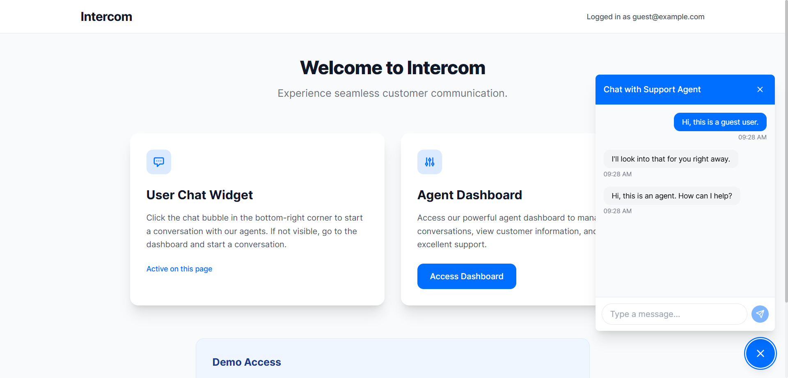
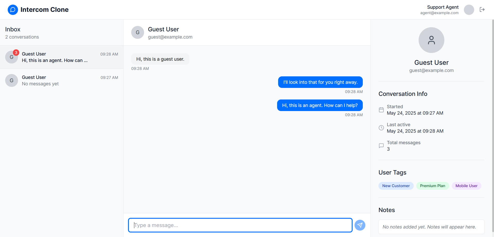

# Intercom

## Installation

### Steps to Install

1. Clone the repository:

   ```bash
   git clone https://github.com/iamatifmoin/Intercom.git
   cd Intercom
   ```

2. Install the dependencies:
   Using npm:
   ```bash
   npm install
   ```
   Or using Yarn:
   ```bash
   yarn install
   ```

### Running the Development Server

To run the application locally:

1. Run the development server:

   ```bash
   npm run dev
   ```

   Or with Yarn:

   ```bash
   yarn dev
   ```

2. Visit `http://localhost:5173` in your browser to access the application.

## Screenshot

### User



### Agent



## Demo Credentials

```
Email: agent@example.com
Password: agent123
```

## Deployed Link

[Intercom (Vercel)](https://intercom-omega.vercel.app/)
